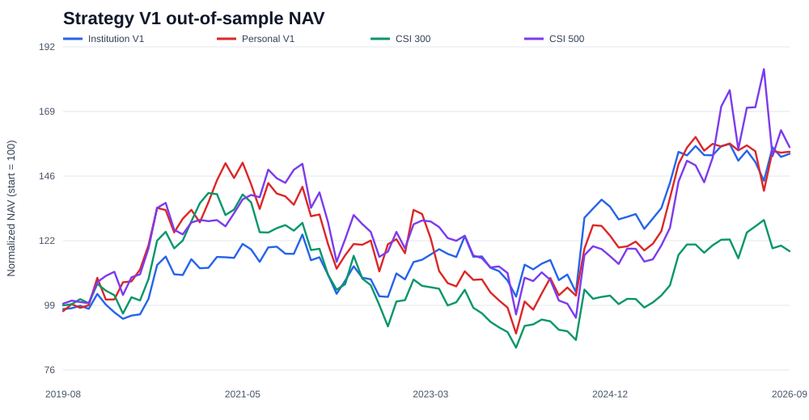

# Monthly A-Share Stock Selection and Backtesting

[中文](README.md)

This repository contains a monthly A-share stock-selection and backtesting system. Its research universe combines historical CSI 300 and CSI 500 constituents. Price, volume, and volatility factors are used to rank stocks, and a buffered replacement policy limits portfolio turnover.

The implementation covers data synchronization, quality checks, factor construction, walk-forward evaluation, portfolio construction, execution simulation, and performance analysis. V1 records the path from raw bars to orders, positions, cash, and account NAV.

Current version: `v1.0.0`. The code is deterministic and tested, but the evidence grade remains `LIMITED_RESEARCH` because the project relies on free data.

## Results

Out-of-sample period: `2019-08-01` to `2026-09-04`, with 85 monthly rebalance observations.

| Profile | Initial cash | Target names | Ending NAV | Total return | Annualized return | Max drawdown |
|---|---:|---:|---:|---:|---:|---:|
| Institution | ¥5.0m | 50 | ¥7.684m | 53.68% | 6.49% | -21.84% |
| Personal | ¥300k | 5 | ¥463k | 54.42% | 6.57% | -44.16% |



These are not presented as universal outperformance. CSI 500 returned `56.08%` over the same interval and universe equal weight returned `65.49%`. The five-stock profile also suffered a `-44.16%` drawdown. The [validation report](docs/formal_strategy_validation.en.md) includes the unsuccessful comparisons alongside the favorable ones.

## Strategy

At each month end, the system:

1. computes momentum, trend, short-term reversal, risk, and price-volume features using information available by that close;
2. uses XGBoost to rank the eligible cross-section;
3. keeps existing holdings inside a wider exit buffer;
4. admits a replacement only when its rank improvement is large enough;
5. submits the target for the next available open;
6. rounds buys down to the security's lot size—normally 100 shares—and applies trading costs and execution checks.

The score is a relative rank, not a probability of profit. The project does not use an LLM in the signal path and does not implement intraday trading.

The institution profile allows at most ten routine replacements per month. The five-stock personal profile allows one. Both rank a broad universe before constructing the final account.

See the full [strategy specification](docs/strategy.md).

## What is implemented

```text
free-data synchronization and storage audit
    → causal factors and T+1 labels
    → purged walk-forward evaluation
    → XGBoost cross-sectional ranking
    → low-turnover portfolio construction
    → orders, fills, positions, cash, and NAV
    → parameter, cost, ablation, and attribution reports
```

The backtest models 100-share lots, minimum commission, sell tax, transfer fees, slippage, volume participation, cash constraints, suspensions, price limits, dividends, and bonus shares. Orders that cannot be filled are rejected rather than assumed to succeed.

## Quick demo

Python `3.11+` is required.

```powershell
python -m venv .venv
.\.venv\Scripts\Activate.ps1
python -m pip install -e ".[dev]"
python scripts/run_demo.py
```

The demo uses deterministic synthetic prices to exercise the software path. Its returns are not research evidence. The current suite contains 53 passing tests:

```powershell
ruff check src tests scripts
pytest
```

## Real-data workflow

```powershell
python -m pip install -e ".[data,dev]"
ashare-quant sync-data --universe csi800 --start 2015-01-01 --data-dir data/csi800_pit_market --skip-historical-status
ashare-quant audit-data --data-dir data/csi800_pit_market
```

The synchronizer can resume missing downloads. The audit checks instrument type, six-character codes, duplicate bars, OHLC validity, history length, universe coverage, and benchmark coverage. See the [reproducibility guide](docs/reproducibility.md) for the complete walk-forward and validation commands.

## Indicative order sheet

Run the standard research pipeline to score the latest market date:

```powershell
ashare-quant run --data data/csi800_pit_market --config configs/low_turnover_personal.toml --output artifacts/live_personal --allow-non-research-ready
```

Then provide actual cash and current positions:

```powershell
ashare-quant plan-orders --scores artifacts/live_personal/latest_scores.csv --data data/csi800_pit_market --positions data/positions.example.csv --cash 300000 --config configs/low_turnover_personal.toml --output artifacts/order_plan
```

`planned_orders.csv` contains `BUY`, `SELL`, and `HOLD` rows, current and target quantities, estimated notional and fees, model score, and two leading factor explanations. It is an indicative research sheet, not a broker connection. Prices and trading status must be checked again before execution, and the monthly policy should only rebalance on its scheduled signal date.

## Repository layout

```text
src/ashare_quant/        research, model, portfolio, and backtest package
configs/                 frozen institution and personal configurations
scripts/                 demo, validation, and evidence exporters
tests/                   data, causality, execution, and ledger tests
docs/                    design, strategy, validation, and reproduction notes
results/v1/              compact V1 evidence intended for Git
data/                    local market data, ignored by Git
artifacts/               predictions and ledgers, ignored by Git
```

The root `xgboost选股.ipynb` is retained as the original prototype. V1 results come from the package, frozen configurations, and scripts.

## Limitations

Free sources do not provide complete daily historical ST/status fields or point-in-time industry classifications. The simulator is more realistic than a return-only backtest, but it is not an exchange matching engine. The project does not connect to a brokerage account, and V1 has not demonstrated stable outperformance against CSI 500 or universe equal weight.

Further reading: [architecture](docs/architecture.md), [validation](docs/formal_strategy_validation.en.md), [reproducibility](docs/reproducibility.md), [V1 freeze](docs/v1_freeze.md), and [disclaimer](DISCLAIMER.md).

License: [MIT](LICENSE)
