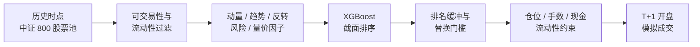
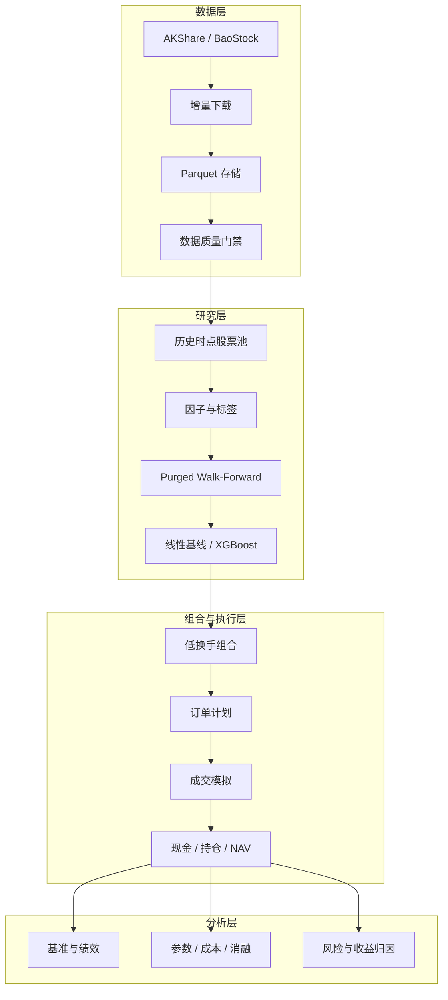

<div align="center">

# A股月频选股与执行回测系统

基于历史时点股票池、XGBoost 截面排序和低换手组合规则的 A 股研究项目


[策略逻辑](#策略逻辑) · [样本外结果](#样本外结果) · [系统结构](#系统结构) · [快速运行](#快速运行) · [生成候选订单](#生成候选订单) · [English](README.en.md)

</div>

---

## 项目概述

项目研究范围为历史时点的沪深 300 与中证 500 成分股。系统每月使用价格、成交量和波动率因子对股票排序，再根据排名缓冲、替换门槛和交易约束构建组合。

代码覆盖了从原始行情到组合账本的完整流程：

```text
数据同步 → 数据审计 → 因子与标签 → Walk-Forward → 股票排序
        → 组合构建 → 订单与成交 → 持仓与现金 → 绩效验证
```

回测按 A 股交易规则处理 100 股交易单位、佣金最低收费、卖出印花税、过户费、滑点、停牌、涨跌停、成交量上限和现金余额。模型未使用 LLM，不包含日内交易，也不连接真实券商账户。

## 样本外结果

回测区间为 `2019-08-01` 至 `2026-09-04`，包含 1,722 个交易日和 85 次月度调仓信号。


| 指标 | 机构版 | 个人版 |
|---|---:|---:|
| 初始资金 | 5,000,000 元 | 300,000 元 |
| 目标持股数 | 50 | 5 |
| 期末资产 | **7,684,181.67 元** | **463,266.77 元** |
| 累计收益 | **53.68%** | **54.42%** |
| 年化收益 | 6.49% | 6.57% |
| 年化波动率 | 17.40% | 20.28% |
| Sharpe | 0.448 | 0.415 |
| 最大回撤 | **-21.84%** | **-44.16%** |
| 平均调仓换手 | 45.70% | 44.49% |
| 总交易费用 | 127,923.44 元 | 7,854.12 元 |

### 基准比较

| 基准 | 累计收益 | 机构版相对差 | 个人版相对差 |
|---|---:|---:|---:|
| 沪深 300 | 18.58% | +35.10% | +35.84% |
| 上证综指 | 34.02% | +19.66% | +20.40% |
| 深证成指 | 44.93% | +8.75% | +9.49% |
| 中证 500 | 56.08% | -2.39% | -1.65% |
| 历史时点股票池等权 | 65.49% | -11.81% | -11.07% |

> 两套组合均跑赢沪深 300、上证综指和深证成指，但没有跑赢中证 500 及股票池等权。个人版收益与机构版接近，最大回撤却明显更高，因此个人版主要用于展示小资金账户的组合与订单处理，不作为策略稳健性的主要依据。

## 策略逻辑

策略在每个月最后一个交易日收盘后产生信号，并在下一个可交易日开盘执行。



### 信号时点

- 信息截止：T 日收盘；
- 信号生成：T 日收盘后；
- 最早成交：T+1 日开盘；
- 预测目标：T+1 日开盘至 T+20 日收盘的个股收益，减去同期股票池收益中位数；
- 训练方式：带标签边界清洗的 expanding Walk-Forward。

### 因子

| 因子组 | 使用的信息 | 作用 |
|---|---|---|
| 动量 | 20-5 日、60-5 日收益 | 衡量中短期相对强弱，并跳过最近 5 日 |
| 趋势 | 60 日趋势质量、120 日高点位置 | 区分稳定趋势与短期冲高 |
| 反转 | 5 日市场残差收益 | 捕捉个股短期过度反应 |
| 风险 | 特质波动率、下行波动率 | 限制高波动和下跌路径风险 |
| 量价 | 成交活跃度、量价确认、收盘位置 | 判断价格变化是否得到交易行为支持 |

XGBoost 输出同一调仓日内的相对排序分数，不输出上涨概率或目标价格。固定权重线性模型作为对照保留在研究流程中。

### 低换手规则

| 参数 | 机构版 | 个人版 |
|---|---:|---:|
| 新股票准入 | 排名前 50 | 排名前 5 |
| 原持仓退出 | 跌出前 100 | 跌出前 12 |
| 每月最多常规替换 | 10 只 | 1 只 |
| 新旧股票最小排名改善 | 10 名 | 5 名 |
| 单股权重上限 | 3% | 25% |
| 权重免调仓范围 | ±0.5% | ±3.0% |
| 最低非清仓交易金额 | 5,000 元 | 2,000 元 |
| 目标现金比例 | 2% | 2% |

股票不会仅因跌出买入排名就立即卖出。只有原持仓跌出较宽的退出区间，且新候选排名改善足够明显时，才会发生常规替换。

买入数量按照股票的 `lot_size` 向下取整；普通 A 股在缺少该字段时默认按 100 股计算。资金不足一手时保留现金，不生成零股买单。清仓卖出可以处理分红送股等原因产生的零股尾仓。

完整定义见[策略说明](docs/strategy.zh-CN.md)。

## 稳健性验证

| 验证项目 | 范围 | 主要结果 |
|---|---|---|
| 参数稳定性 | 机构 27 组、个人 9 组 | 机构累计收益 50.52%–76.17%；个人 53.24%–54.42% |
| 成本压力 | 0、1、2、3 倍交易成本 | 3 倍成本下机构 40.65%，个人 43.09% |
| 因子消融 | 完整模型及删除五类因子 | 量价因子提供明显增量；风险因子主要约束回撤 |
| 市场状态 | 牛市、震荡、熊市 | 熊市阶段 RankIC 和组合收益明显下降 |
| 执行归因 | 费用、现金、拒单 | 交易限制产生现金拖累，理论排名不能完全转化为净值 |

| 交易成本压力测试 | 因子组消融 |
|:---:|:---:|
|  |  |

完整表格和解释见[正式验证报告](docs/formal_strategy_validation.md)，机器可读汇总位于 [`results/v1`](results/v1/README.md)。

## 系统结构



研究计算采用按股票分组的向量化处理，订单、现金和持仓采用逐事件模拟。数据时点、训练边界和实际成交分别由独立模块检查。

详细设计见[系统架构](docs/architecture.zh-CN.md)。

## 快速运行

项目要求 Python `3.11+`。

```powershell
python -m venv .venv
.\.venv\Scripts\Activate.ps1
python -m pip install -e ".[dev]"
python scripts/run_demo.py
```

`run_demo.py` 使用固定随机种子生成合成行情，并运行数据检查、因子计算、模型训练和回测。合成数据仅用于验证软件流程，其收益不属于策略证据。

运行代码检查与测试：

```powershell
ruff check src tests scripts
pytest
```

当前测试结果为 `53 passed`。

## 真实数据流程

安装数据依赖：

```powershell
python -m pip install -e ".[data,dev]"
```

下载并检查中证 800 范围的数据：

```powershell
ashare-quant sync-data --universe csi800 --start 2015-01-01 --data-dir data/csi800_pit_market --skip-historical-status
ashare-quant audit-data --data-dir data/csi800_pit_market
```

下载任务采用增量更新，失败后可以重复运行。数据清单、接口结果、质量门禁和证据等级保存在 `data/csi800_pit_market/metadata/`。

完整研究复现步骤见[复现手册](docs/reproducibility.md)。

## 生成候选订单

使用最新行情生成股票分数：

```powershell
ashare-quant run --data data/csi800_pit_market --config configs/low_turnover_personal.toml --output artifacts/live_personal --allow-non-research-ready
```

输入实际现金和当前持仓，生成候选订单：

```powershell
ashare-quant plan-orders --scores artifacts/live_personal/latest_scores.csv --data data/csi800_pit_market --positions data/positions.example.csv --cash 300000 --config configs/low_turnover_personal.toml --output artifacts/order_plan
```

输出文件 `artifacts/order_plan/planned_orders.csv` 包括：

- 股票代码、名称和规模分组；
- `BUY`、`SELL` 或 `HOLD`；
- 当前数量、目标数量和订单数量；
- 参考价格、预计金额和费用；
- 模型分数及两个主要因子原因。

候选单使用最近收盘价估算，属于研究输出。实际执行前需要重新确认下一交易日的价格、停牌、涨跌停、现金和证券状态。月频策略只在规定的调仓日产生正式换仓信号。

## 目录结构

```text
src/ashare_quant/        数据、因子、模型、组合和回测代码
configs/                 默认配置及机构版、个人版配置
scripts/                 演示、回测、验证和结果导出脚本
tests/                   数据、因果性、执行和账本测试
docs/                    策略、架构、验证和复现文档
results/v1/              可提交到 Git 的 V1 汇总结果
data/                    本地行情数据，不提交到 Git
artifacts/               模型、预测和交易账本，不提交到 Git
```

根目录的 `xgboost选股.ipynb` 是早期原型。V1 结果由 `src/` 下的代码、冻结配置和脚本生成。

## 数据与方法限制

- 免费数据缺少完整的逐日历史 ST、证券状态和历史时点行业分类；
- 历史指数成分使用月末快照近似，精度低于授权的逐日成分数据库；
- 成交模拟考虑常见约束，但不等同于交易所撮合或券商柜台；
- 回测没有估计大额订单的完整市场冲击；
- 模型在熊市阶段的排序能力较弱；
- 当前结果未证明策略能够稳定跑赢中证 500 或股票池等权；
- 系统不连接真实账户，也不会自动发送订单。

本项目用于软件工程和量化研究方法展示，不构成投资建议或收益承诺。详见[免责声明](DISCLAIMER.md)。

## 文档

| 文档 | 内容 |
|---|---|
| [策略说明](docs/strategy.zh-CN.md) | 因子、标签、模型和组合规则 |
| [系统架构](docs/architecture.zh-CN.md) | 模块职责和数据流 |
| [正式验证报告](docs/formal_strategy_validation.md) | 参数、成本、消融和归因 |
| [复现手册](docs/reproducibility.md) | 环境、数据和运行命令 |
| [V1 冻结清单](docs/v1_freeze.md) | 版本、配置、结果和输入指纹 |
| [English README](README.en.md) | English project overview |

项目使用 [MIT License](LICENSE)。
