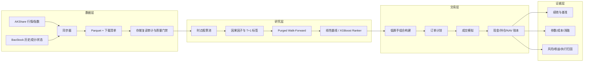

# 系统架构

[English](architecture.md)

## 设计目标

平台将常见量化 Notebook 里混在一起的三件事拆开：

1. **数据时点真相：**历史某一天究竟能看到什么数据；
2. **模型验证真相：**训练、验证、测试是否严格按时间隔离；
3. **交易执行真相：**目标仓位是否能在 A 股规则下真正成交并落到账本。



## 关键模块

| 模块 | 职责 | 重点防范的问题 |
|---|---|---|
| 数据下载器 | 股票、指数、证券元数据、成分与公司行动同步 | 接口失败、断点续传、基金代码混入 |
| 存储审计 | 重新打开持久化文件并执行门禁 | 重复 K 线、代码前导零丢失、原始/复权价混用 |
| 时点股票池 | 按历史有效期选择中证 300/500 成分 | 用今天成分倒填历史造成幸存者偏差 |
| 因子引擎 | 按股票计算只依赖过去的滚动特征 | 跨股票滚动、未来数据泄漏 |
| 数据集构建器 | 对齐 T 日信号、T+1 开盘与 T+20 收盘标签 | 同收盘价成交、标签跨越切分边界 |
| Walk-Forward | 每折重训并只拼接测试期预测 | 测试集参与早停或调参 |
| 模型层 | 固定权重线性基线与 XGBoost 截面排序 | 复杂模型没有超过透明基线 |
| 组合构建器 | 排名缓冲、替换门槛、分散与现金目标 | 每月全换、过度集中、配置不可行 |
| 执行模拟器 | 手数、费用、涨跌停、停牌、成交量与现金约束 | 假设无法成交的订单成交 |
| 公司行动账本 | 股息、送股和配股权益显式入账 | 除权日前后虚假盈亏 |
| 分析层 | RankIC、基准、成本、稳定性、消融和归因 | 只展示一个好看的收益率 |

## 核心数据流

```text
Bar → FactorObservation → Signal → TargetWeight
    → Order → Fill → Position + Cash → PortfolioSnapshot
```

核心记录都有日期、股票代码和来源上下文。模型分数不直接等于订单；组合与执行层会把不可成交、低于一手、现金不足或超过成交量上限的部分拒绝或留成现金。

## 基准体系

系统保留六个彼此独立的对照，不把它们混成一个“综合指数”：

1. 股票池等权：判断选股是否优于可选候选集；
2. 中证 800：对应大中盘研究范围；
3. 沪深 300：观察大盘风格相对表现；
4. 中证 500：观察中盘风格相对表现；
5. 上证综指：大众熟悉的上海市场背景；
6. 深证成指：大众熟悉的深圳市场背景。

所有基准只向后对齐到策略交易日，不使用未来指数值。报告包括累计超额、跟踪误差、信息比率、Alpha/Beta、相关性和逐年收益。

## 为什么是向量化研究 + 事件驱动交易

数百万日频行适合按股票向量化计算，订单、现金和持仓却具有状态依赖，必须逐事件处理。混合架构既保留研究速度，也能留下可对账的订单—成交—持仓链。

## 生产边界

当前仓库是研究与模拟平台。真正券商生产系统还需要授权行情、证券主数据、持久化事件总线、账户与权限、交易前风控、柜台适配、日终清算对账、监控告警、灾备、审批留痕和监管报送；V1 没有假装实现这些部分。
