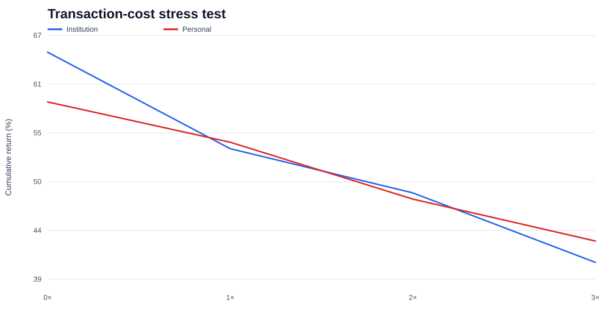
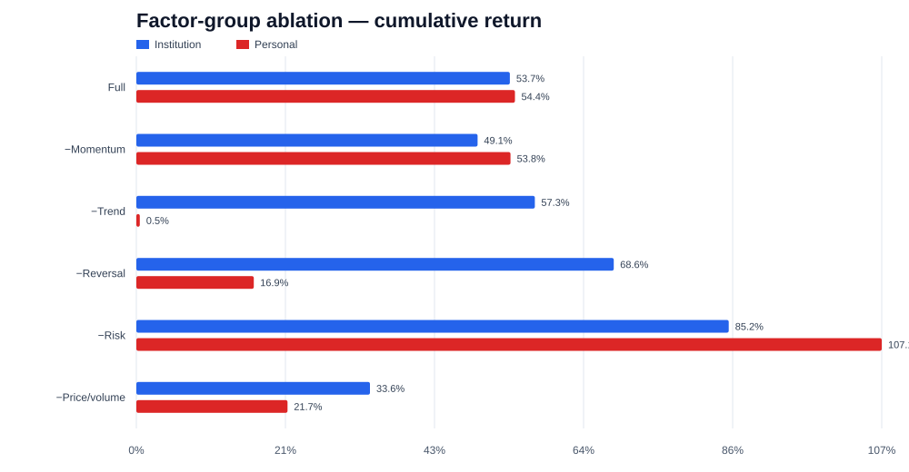

# Strategy V1 formal validation — English summary

[中文完整报告](formal_strategy_validation.md)

## Scope

The validation freezes the point-in-time CSI 300 + CSI 500 universe approximation and eight-fold purged walk-forward predictions. Portfolio and cost scenarios reuse the frozen out-of-sample scores; factor ablations retrain XGBoost inside the same fold boundaries. The period is `2019-08-01` to `2026-09-04` (1,722 trading days, 85 monthly signals).

The study covers 36 turnover-policy configurations, eight transaction-cost scenarios, the full model plus five factor-group removals, 12 portfolio ablation backtests, and annual/regime/size/drawdown/execution attribution.

## Frozen baseline

| Metric | Institution | Personal |
|---|---:|---:|
| Initial capital | ¥5,000,000 | ¥300,000 |
| Target names | 50 | 5 |
| Ending NAV | ¥7,684,181.67 | ¥463,266.77 |
| Total return | 53.68% | 54.42% |
| Annualized return | 6.49% | 6.57% |
| Sharpe ratio | 0.448 | 0.415 |
| Maximum drawdown | -21.84% | -44.16% |
| Mean rebalance turnover | 45.70% | 44.49% |
| Fees / initial capital | 2.56% | 2.62% |

Both profiles beat CSI 300, SSE Composite, and SZSE Component, but lagged CSI 500 by approximately 2.39 and 1.65 percentage points, and universe equal weight by 11.81 and 11.07 points.

## Parameter and cost robustness

| Metric | Institution: 27 scenarios | Personal: 9 scenarios |
|---|---:|---:|
| Total-return range | 50.52%–76.17% | 53.24%–54.42% |
| Sharpe range | 0.431–0.565 | 0.409–0.415 |
| Max-drawdown range | -22.46%–-19.33% | -44.69%–-44.16% |
| Positive-return rate | 100% | 100% |
| Beat CSI 500 rate | 66.67% | 0% |

At three times baseline costs, cumulative return fell to 40.65% for the institution profile and 43.09% for the personal profile. Both still beat CSI 300 and SSE Composite, but no longer beat SZSE Component or CSI 500.

## Factor ablation

| Model | RankIC | Institution return | Institution drawdown | Personal return | Personal drawdown |
|---|---:|---:|---:|---:|---:|
| Full model | 0.0428 | 53.68% | -21.84% | 54.42% | -44.16% |
| Remove momentum | 0.0443 | 49.05% | -24.32% | 53.78% | -26.36% |
| Remove trend | 0.0465 | 57.28% | -27.61% | 0.50% | -35.24% |
| Remove reversal | 0.0468 | 68.62% | -26.78% | 16.88% | -43.00% |
| Remove risk | 0.0234 | 85.15% | -30.30% | 107.14% | -55.29% |
| Remove price/volume | 0.0351 | 33.59% | -29.77% | 21.73% | -55.94% |

Price/volume features provide clear incremental information. Risk features act as regularization: removing them raises headline return but materially weakens RankIC and drawdown. Trend and reversal interact nonlinearly. The five-stock profile is highly specification-sensitive and is not the primary evidence for model validity.

## Regime and execution findings

- Bull-regime compounded return: +53.40% institution, +49.82% personal.
- Sideways-regime compounded return: +28.29% institution, +42.52% personal.
- Bear-regime compounded return: -21.91% institution, -27.68% personal.
- RankIC declines from about 0.0696 in bull regimes to 0.0156 in bear regimes.
- Rejections and residual cash show that theoretical ranks do not translate one-for-one into portfolio NAV.

## Research judgment

The institution profile passes the current parameter and cost robustness checks and is the project's primary strategy. The personal profile demonstrates small-account configurability but fails model-specification stability and carries structural concentration risk. The signal contains weak but repeatable cross-sectional information; it is not yet strong enough to claim stable outperformance versus CSI 500 or universe equal weight.

The evidence grade remains `LIMITED_RESEARCH` because free data does not provide complete daily historical security status and point-in-time industry classifications. Full machine-readable ledgers are local under `artifacts/strategy_validation/`; compact Git-safe summaries are in [`results/v1`](../results/v1/README.md).
